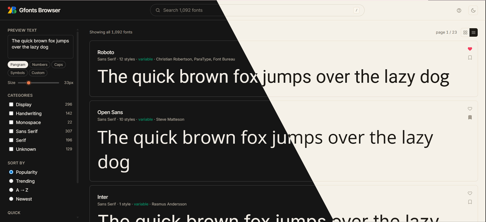

# Gfonts Browser

A local Google Fonts–style browser for your offline TTF collection.
Browse, preview, filter, compare, install — all served from your own machine.



> Personal tool for graphic designers. Built on **Laravel 11 + Alpine.js + Tailwind + SQLite**, with a stdlib-only Python loader and a PowerShell per-user font installer for Windows.

## Why

Picking a font for a project means a lot of small decisions: does it support Indonesian accents, does it pair with my body font, do the numbers tabulate, can I install just the weights I need, did the client already approve this one in 2024? Browsing online doesn't help with most of that.

This tool turns your local TTF collection into a working library:

- Searchable, filterable, taggable
- Previewable in real-world mockups (article, poster, UI, logo)
- Pairing-aware
- 1-click install per weight
- Notes + tags per family

Nothing leaves your machine. Re-indexable in 10 seconds. ~5,000 fonts handled smoothly.

## Quick start

```bash
git clone https://github.com/s4rt4/gfonts-browser.git
cd gfonts-browser

composer install
npm install

cp .env.example .env
php artisan key:generate
```

Edit `.env` with absolute paths:

```ini
APP_NAME="Gfonts Browser"
FONTS_ROOT="C:/path/to/your/ttf-folder"
DB_CONNECTION=sqlite
DB_DATABASE="C:/absolute/path/to/database/fonts.sqlite"
DB_FOREIGN_KEYS=true
```

```bash
touch database/fonts.sqlite
php artisan migrate

# Index your TTF collection (one-shot, idempotent)
python tools/load_fonts.py

# Build assets + run
npm run build
php artisan serve
```

Open <http://localhost:8000>.

---

## Features

### Browse

- **Grid + list view** with toggle, persisted to localStorage
- **Live preview** — every card renders in its own font with your sample text and chosen size
- **Lazy `@font-face` injection** — only the visible page loads font files (5,000+ fonts handled smoothly)
- **Capsule search** in the header (press `/` to focus, `Esc` to blur)
- **Tag search syntax** — type `#tag-name` to filter by your custom tags
- **Filter chips** above the grid — each active filter shows as a removable pill, plus a "Clear all" link
- **Differentiated empty states** for search no-match, no-favorites, empty-collection
- **Pagination** — 48 fonts/page (matches Google Fonts), chevron icons, tabular numerals
- **Recently viewed** — bar above the grid shows your last 10 opened families (auto-hides when filters are active)
- **URL state** — filters reflected in URL, bookmarkable and shareable

### Detail page — sticky compact editor

A 44px sticky bar follows you down the page with all controls inline:

```
[Sample][Article][Poster][UI][Logo]   [text input]   [Pangram ▾]   [size 64px]   ☐ Italic   [OT 2]   ⟲
```

#### Mockup tabs

Preview the font in realistic contexts, not just a static sample line:

| Mode | Layout |
|---|---|
| **Sample** | Free text input + size slider 14–200 px |
| **Article** | 56 px headline + 18 px body paragraphs + 13 px byline |
| **Poster** | `clamp(80px, 14vw, 200px)` single huge word |
| **UI** | Sign-in form mockup (label + input + button + caption) |
| **Code** | 14 px monospace pseudo-code block (Monospace fonts only) |
| **Logo** | `clamp(56px, 10vw, 120px)` brand mark with subtitle |

All mockups inherit the current variable axes settings + OpenType features.

#### Variable axes sliders

Every variable axis (wght, wdth, opsz, slnt, ital, custom axes) gets a labeled slider with live preview. Axis registry from `fonts.json` provides description tooltips.

#### Italic toggle

- Uses `font-style: italic` if a static italic file exists
- Falls back to `slnt` axis minimum on variable fonts when no italic file is present
- Auto-hides if neither path is applicable (e.g., display fonts with no italic + no slnt axis)

#### OpenType features panel

15 togglable features, applied via `font-feature-settings` to all preview surfaces:

| Tag | Feature |
|---|---|
| `liga` / `dlig` | Standard / discretionary ligatures |
| `smcp` / `c2sc` | Small caps / caps to small caps |
| `salt` / `ss01–ss03` | Stylistic alternates and sets |
| `tnum` / `onum` / `lnum` | Tabular / old-style / lining figures |
| `frac` | Fractions |
| `sups` / `sinf` | Super / subscript |
| `kern` | Kerning |

Active feature count shows as a badge on the OT button.

#### Glyph map

8 character groups rendered in the family — missing glyphs fall back to the system font and stand out instantly:

- Uppercase, Lowercase, Numbers
- Indonesian / Latin (`á à â ä ã é è ê ë í ì î ï ó ò ô ö õ ú ù û ü ñ ç` + caps)
- Punctuation, Currency, Math, Symbols

#### Pairs well with

Heuristic pairing suggestions by category, 4 cards each:

| Family category | Suggested pairings |
|---|---|
| Display / Handwriting | Body sans · Body serif · Similar feel |
| Sans Serif | Editorial serif · Display headlines · Similar sans |
| Serif | Body sans · Display headlines · Similar serif |
| Monospace | Pair with sans · Pair with serif · Similar mono |

Each card renders `Aa Bb 123` in the suggested font's actual face. Click → navigate to that family's detail page.

#### Type specimen

Alphabet (upper + lower), numbers, symbols, 3 pangrams in different sizes — all in the family.

#### Notes + tags per font

Pencil icon in the header opens an inline editor:

- Free-form note (e.g. "Client A approved 2024-11", "use for editorial body only")
- Chip-style tag input (`Enter` or `,` to add, `×` to remove)
- Tags normalize to lowercase + dashes
- Pencil icon lights up accent when family has any notes/tags
- Tags appear in the sidebar with counts; clicking inserts `#tag-name` into the search

#### Per-weight install / download

Each static style row in the **Styles** section has:

- **Install to Windows** button (state reflects filesystem)
- **Download .ttf** link

Variable files have install buttons too — installing one variable file gives you all weights as a single OS font.

#### Family navigation

- Chevron buttons in the header → previous / next family alphabetically
- Keyboard `←` / `→`
- `Esc` to return to the grid

### Favorites + Collections + Compare

- **Favorites** (heart icon) — single global list, quick toggle on every card
- **Collections** (bookmark icon) — multiple named groups, e.g. "Project Alpha", "Body Sans", "Approved by client"
  - Card → bookmark → modal with checkboxes + new-collection input
  - Sidebar lists all collections with counts; click to filter the grid; hover reveals rename / delete
- **Compare mode** — toggle in sidebar, select up to 4 cards, navigate to side-by-side view with shared size, weight, italic, and sample text controls

### Install to Windows

Per-user install — **no admin required**. Triggered by a `POST /font-file/{id}/install` route that runs `tools/install_font.ps1`:

1. Copies the TTF to `%LOCALAPPDATA%\Microsoft\Windows\Fonts\`
2. Registers it under `HKCU:\SOFTWARE\Microsoft\Windows NT\CurrentVersion\Fonts`
3. Calls `AddFontResource` and broadcasts `WM_FONTCHANGE` — running apps (Word, Photoshop, Figma, Illustrator, etc.) pick up the font without restart

The install state is read from the filesystem on every detail-page load, so the button reflects reality, not browser memory. If you uninstall via Windows Settings → Fonts, the button shows "Install to Windows" again on next reload.

### Theme + UI

- **Light** — daylight cream (`#f5f1e8` / `#1d1a15`), inspired by `daas-v3`. Not pure white — easier on the eyes for long sessions
- **Dark** — `#151515` / `#f4efe8`, warm neutrals
- Theme toggle (sun/moon icon in header), persisted to `localStorage.gfonts.theme`, no flash on reload (set via inline script before paint)
- **Inter** as UI font (fonts.bunny.net mirror, privacy-respecting)
- Native checkbox + radio + slider thumb use the accent color (orange in light, lighter orange in dark) — not browser default blue
- Custom thin scrollbar in sidebar (6 px, accent-tinted on hover)
- Branded modals (logo + app name) replace native `window.prompt()` / `window.confirm()`
- Toast notifications for install success / collection actions
- Card hover lift + soft shadows
- Tabular numerals on counters / sizes
- Smooth `transition-colors` on theme + filter changes

### Keyboard shortcuts

| Key | Action |
|---|---|
| `/` | Focus search input |
| `?` | Show keyboard-shortcuts modal |
| `Esc` | Close modal / blur input / back to grid (on detail page) |
| `←` / `→` | Previous / next family (on detail page) |

### Custom error pages

`404`, `500`, `503` — branded with the app logo and helpful messaging, instead of generic Laravel error pages.

---

## Refreshing TTFs from upstream Google Fonts

Pull the latest TTFs from [github.com/google/fonts](https://github.com/google/fonts):

```bash
python tools/sync_from_google_fonts_repo.py
```

Idempotent. Steps:

1. Clones (or fast-forwards) `google/fonts` into `.google-fonts-source/`
2. Walks the source, copies every `.ttf` into `FONTS_ROOT` (size-based diff, skips unchanged)
3. Refreshes `database/seed/fonts.json` from `fonts.google.com/metadata/fonts`
4. Re-runs `tools/load_fonts.py`

### One-time refresh (auto-cleanup)

```bash
python tools/sync_from_google_fonts_repo.py --clean-source
```

Deletes the source clone after copying — frees ~1.2 GB.

### When `git clone` fails

Some Windows networks have trouble with the 1.2 GB shallow clone over `schannel`. Download the ZIP manually from GitHub and point the script at the extracted folder:

```bash
python tools/sync_from_google_fonts_repo.py \
    --skip-clone \
    --source "C:\path\to\manually-extracted\fonts-main"
```

### Other flags

`--skip-metadata`, `--skip-index`, `--dry-run`.

## Re-indexing only

If you've added or removed TTFs in `FONTS_ROOT` directly:

```bash
python tools/load_fonts.py
```

The loader truncates and re-inserts. Schema lives in Laravel migrations; Python is a pure data loader (stdlib only).

---

## Architecture

```
google-ttf/                    your TTF folder (FONTS_ROOT, gitignored)
    │
    └─→ tools/load_fonts.py    Python stdlib loader, idempotent
                               (matches filenames against fonts.json metadata)
        │
        └─→ database/fonts.sqlite     single source of truth
                │
                └─→ Laravel 11 (FontController)
                        │   reads SQLite, serves TTF via /font-file/{id}.ttf
                        │
                        └─→ Blade + Alpine + Tailwind UI
                                grid, detail, compare, error pages
```

### Schema

- `font_families` — one row per family. Category, popularity, trending, axes (JSON), designers, subsets, variable flag, file count, dates, etc.
- `font_files` — one row per weight/style file. Variable files marked with `is_variable = 1` and `axes_in_filename`.

Schema authority lives in Laravel migrations (`database/migrations/`). Python loader only INSERTs.

### Routes

| Route | Purpose |
|---|---|
| `GET /` | Index grid + sidebar |
| `GET /fonts/{slug}` | Detail page for one family |
| `GET /compare?fonts=A,B,C` | Side-by-side comparison (up to 4) |
| `GET /font-file/{id}.ttf` | Serve TTF (regex-validated filename, realpath-checked) |
| `POST /font-file/{id}/install` | Install to Windows via PowerShell |

### Storage

| Where | What |
|---|---|
| SQLite | Server-side font catalog |
| `localStorage.gfonts.theme` | `'light'` / `'dark'` |
| `localStorage.gfonts.viewMode` | `'grid'` / `'list'` |
| `localStorage.gfonts.favorites` | `[familyName, ...]` |
| `localStorage.gfonts.collections` | `[{ id, name, fonts: [...] }, ...]` |
| `localStorage.gfonts.notes` | `{ [familyName]: { note, tags: [...] } }` |
| `localStorage.gfonts.recent` | last 10 viewed family names |
| URL query params | active search / filter / sort / page state |

---

## Requirements

| Tool | Tested |
|---|---|
| PHP | 8.4 (with `pdo_sqlite` + `sqlite3` extensions enabled in `php.ini`) |
| Composer | 2.4+ |
| Python | 3.10+ (stdlib only, no `pip install` needed) |
| Node | 22 / npm 10 |
| Git | 2.4+ (for the sync script only) |

The Install-to-Windows feature requires Windows + PowerShell. Every other feature is cross-platform — on macOS / Linux the install button is hidden, the rest works.

---

## License

[MIT](LICENSE) — do anything you like, attribution appreciated but not required.
